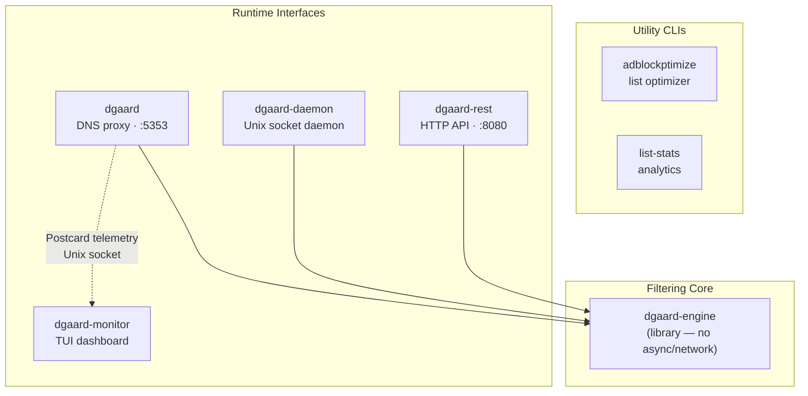
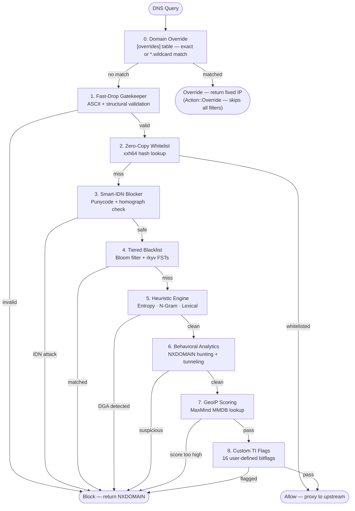
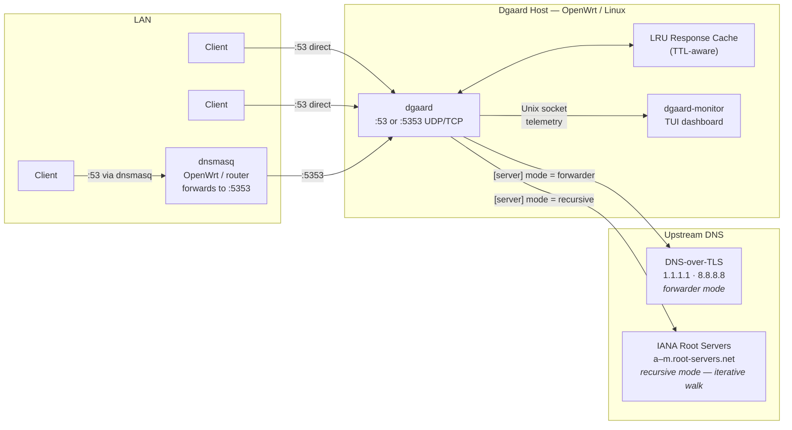
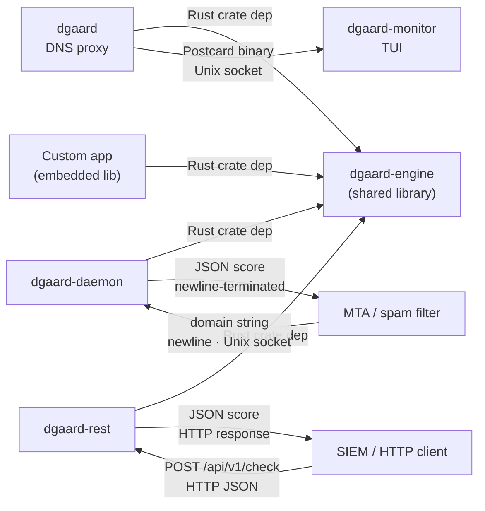
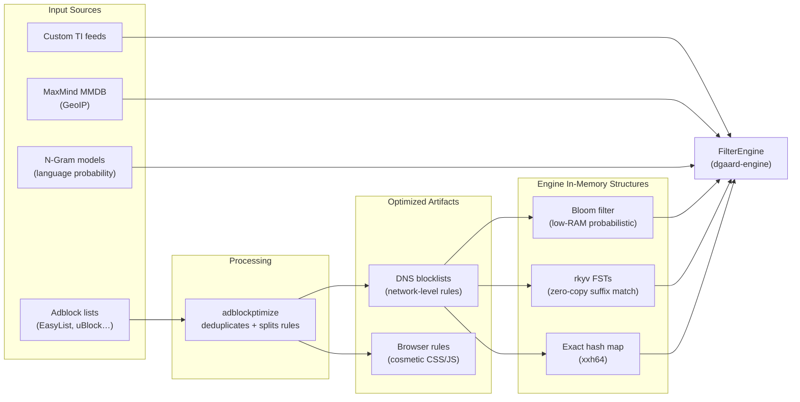
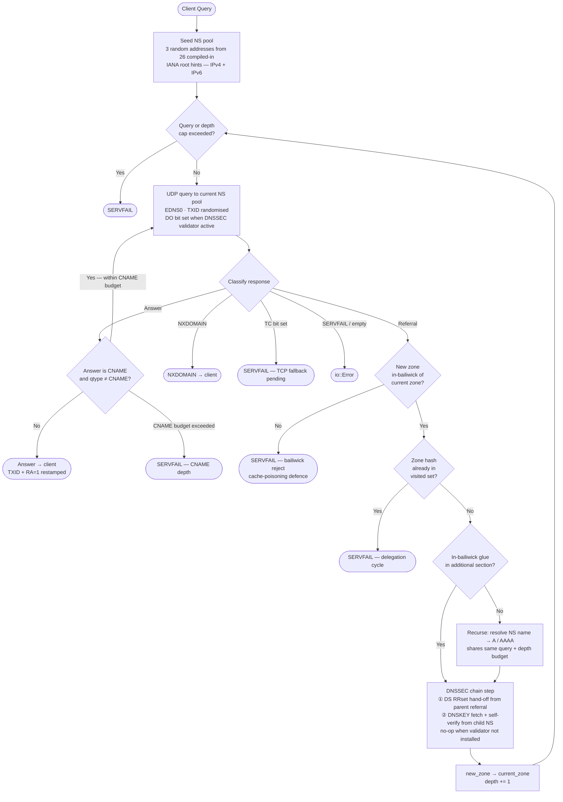

# Architecture

## 1. System Architecture Overview

Relationship between all workspace crates. Solid arrows = Rust compile-time dependency. Dashed arrow = runtime communication.

---

## 2. Stratified Filtering Pipeline

Every DNS query passes through up to 9 stages inside `dgaard-engine`. Stage 0 is checked first and, when matched, bypasses all subsequent stages entirely. Stages 1–8 can each short-circuit to **Block** or **Allow**; otherwise the query falls through to the next stage.

---

## 3. Network Deployment Context

How dgaard sits in a typical LAN (home router, OpenWrt, or SME edge).

Clients can reach dgaard either directly (when dgaard owns `:53`) or via dnsmasq (common on OpenWrt where dnsmasq already handles DHCP and DNS on `:53`, and forwards to dgaard on `:5353`).

---

## 4. Inter-Component Communication

Protocols and data formats used between components at runtime.

---

## 5. Blocklist Data Pipeline

How raw adblock lists are processed into the in-memory structures that `dgaard-engine` queries at runtime.

> Hot-reload: on `SIGHUP`, `FilterEngine` is rebuilt from disk and swapped atomically via `arc-swap` — zero query loss.

---

## 6. Iterative Recursive Resolver

When `[server] mode = "recursive"`, dgaard resolves queries itself by walking the DNS delegation hierarchy from the IANA root servers down to the authoritative nameserver — no external forwarder involved.

Key invariants:

- **Bailiwick**: a referral that widens the current zone is rejected outright (strict) or silently discarded (lenient), preventing cache-poisoning via off-path NS injection.
- **Cycle detection**: every visited zone is recorded as an xxh3-64 hash; a repeat hash aborts with SERVFAIL.
- **Caps**: `max_queries_per_resolution` (total outgoing UDP queries) and `max_delegation_depth` (referral hops) are checked at the top of every loop iteration.
- **Glue safety**: only glue records whose owner name sits inside the newly-delegated zone are accepted; out-of-bailiwick additional records are silently dropped.
- **DNSSEC chain**: when `[security.dnssec] enabled = true`, each delegation hop harvests the child DS from the parent referral and fetches the child's DNSKEY rrset, building the chain of trust incrementally.
