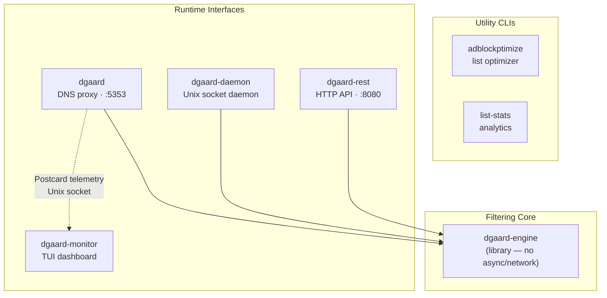
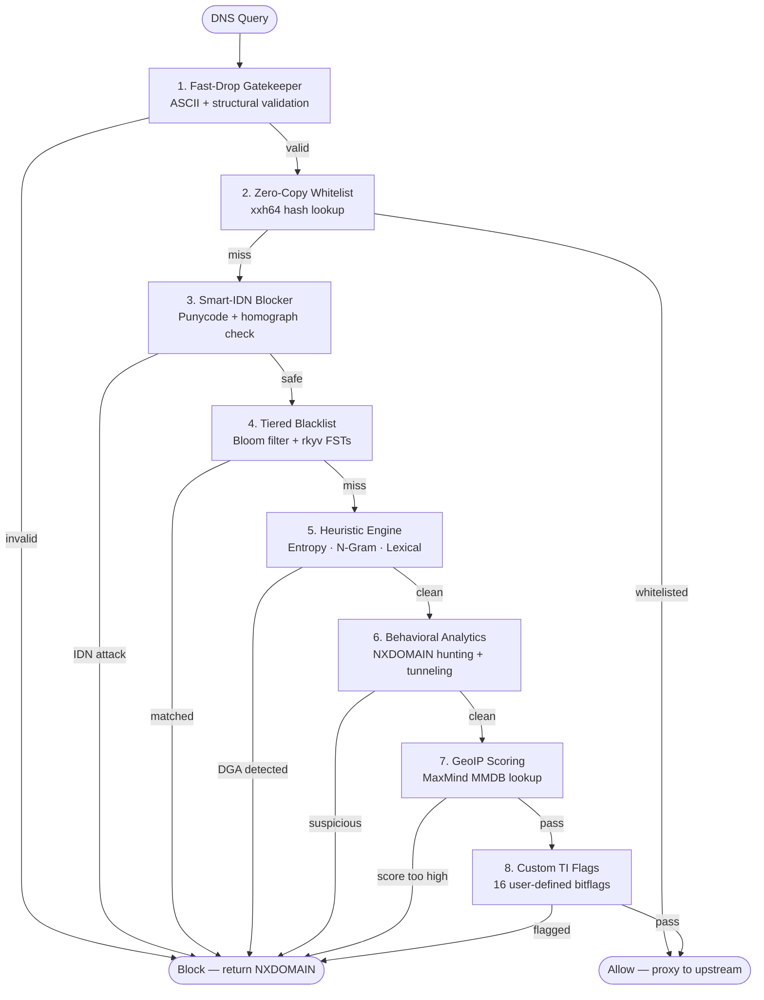
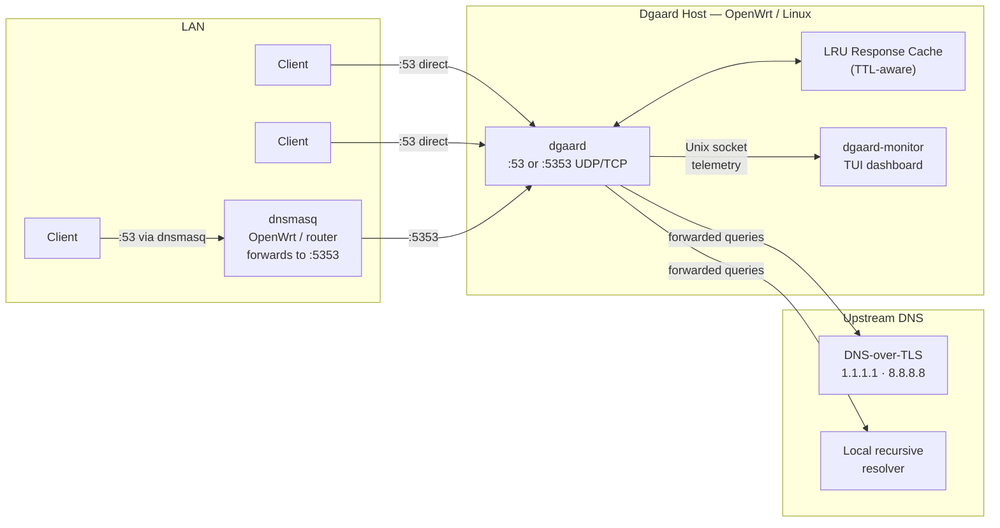
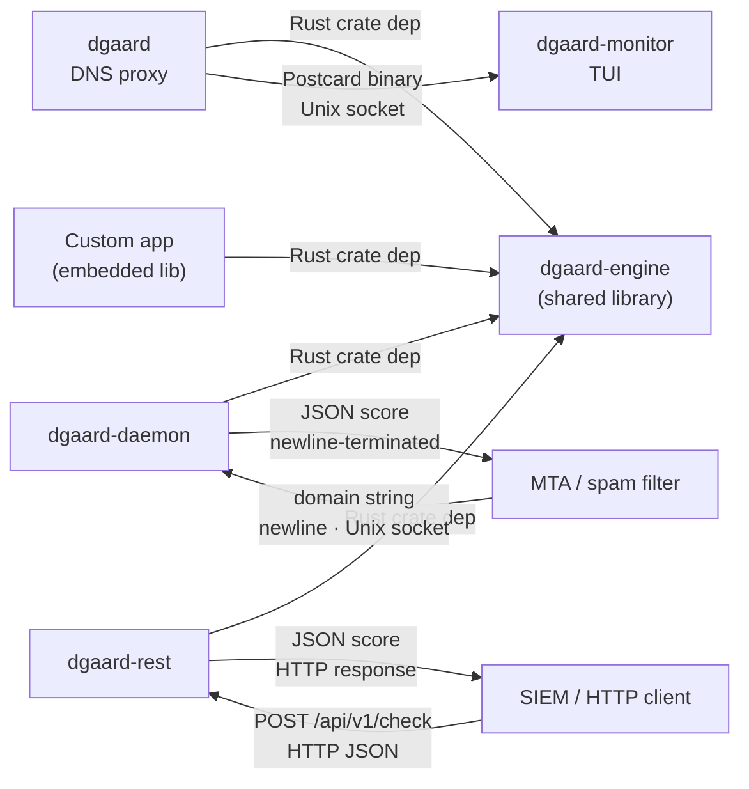
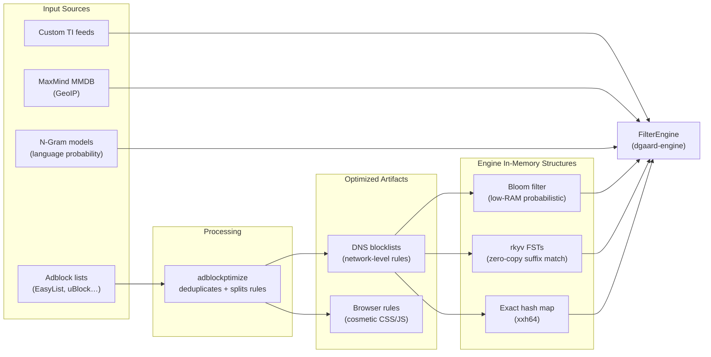

# Architecture

## 1. System Architecture Overview

Relationship between all workspace crates. Solid arrows = Rust compile-time dependency. Dashed arrow = runtime communication.

---

## 2. Stratified Filtering Pipeline

Every DNS query passes through up to 8 stages inside `dgaard-engine`. Each stage can short-circuit to **Block** or **Allow**; otherwise the query falls through to the next stage.

---

## 3. Network Deployment Context

How dgaard sits in a typical LAN (home router, OpenWrt, or SME edge).

Clients can reach dgaard either directly (when dgaard owns `:53`) or via dnsmasq (common on OpenWrt where dnsmasq already handles DHCP and DNS on `:53`, and forwards to dgaard on `:5353`).

---

## 4. Inter-Component Communication

Protocols and data formats used between components at runtime.

---

## 5. Blocklist Data Pipeline

How raw adblock lists are processed into the in-memory structures that `dgaard-engine` queries at runtime.

> Hot-reload: on `SIGHUP`, `FilterEngine` is rebuilt from disk and swapped atomically via `arc-swap` — zero query loss.
